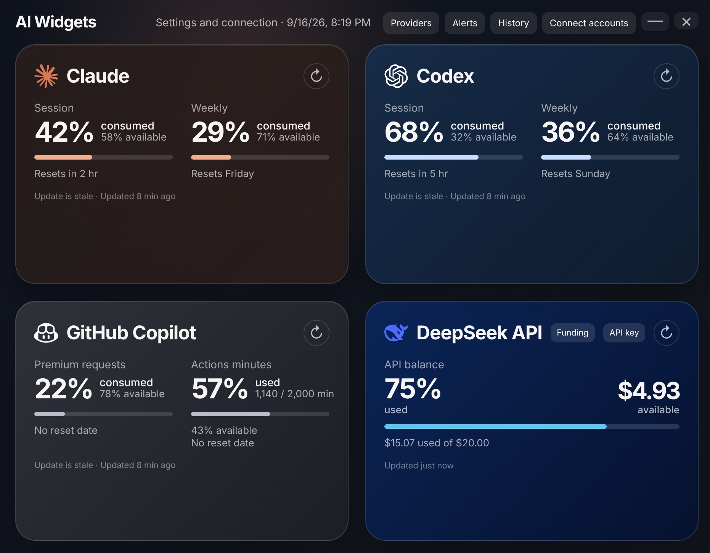
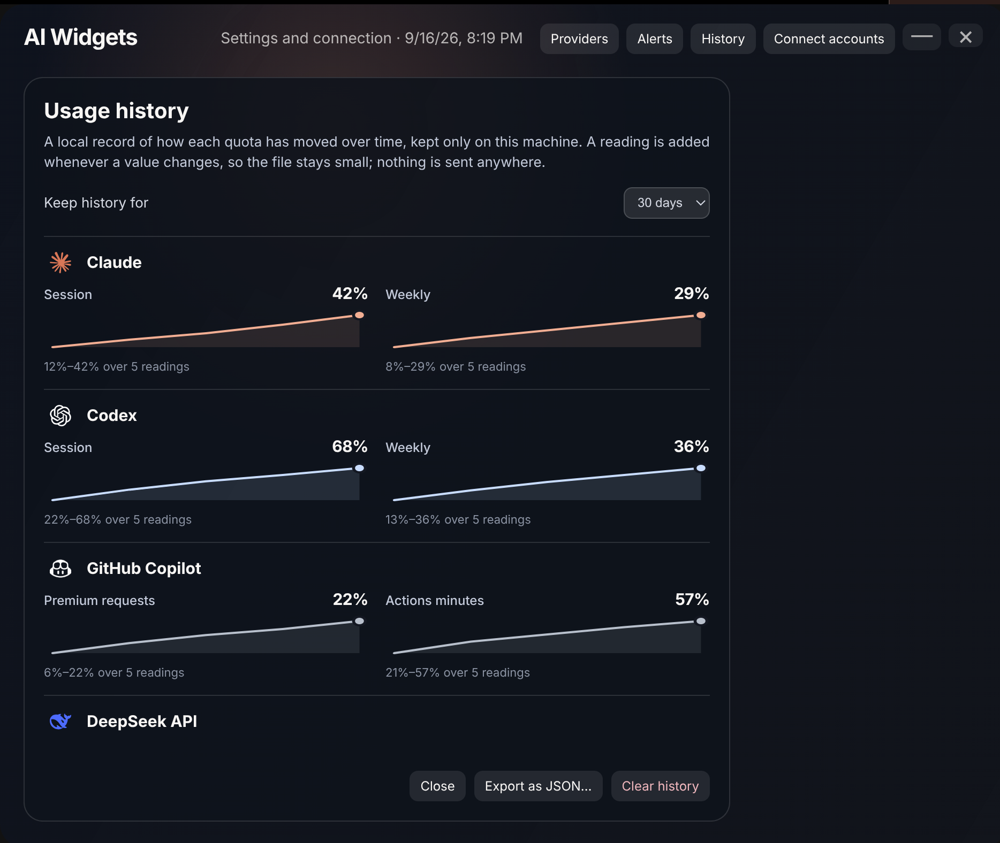
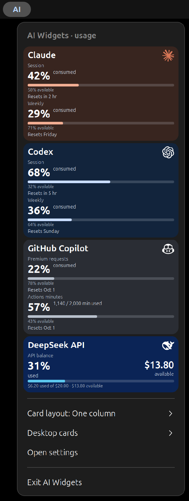
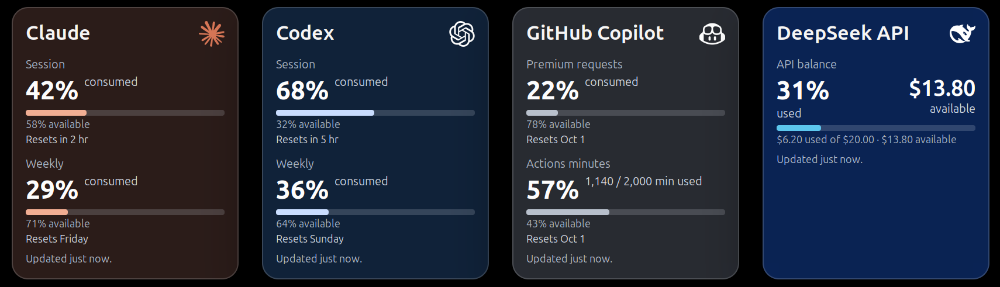
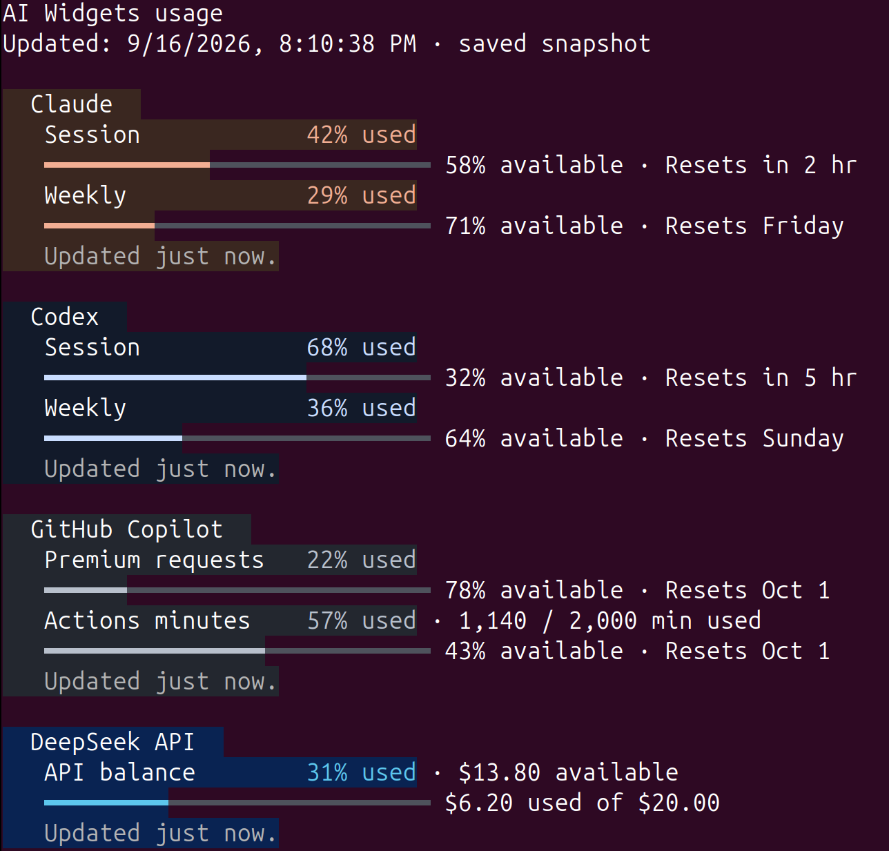

<p align="center">
  
</p>

<h1 align="center">AI Widgets</h1>

<p align="center">
  <strong>Your AI usage. Always in view. Always local.</strong><br>
  Claude · Codex · GitHub Copilot · DeepSeek API
</p>

<p align="center">
  <a href="#install-on-ubuntu-gnome">Ubuntu GNOME</a> ·
  <a href="#macos-desktop-widget-and-menu-bar">macOS</a> ·
  <a href="#connect-subscriptions">Connect providers</a>
</p>

AI Widgets shows session and weekly usage for Claude and Codex, monthly Premium requests and GitHub Actions minutes for Copilot, and API balance for DeepSeek.

Ubuntu GNOME and macOS both provide desktop cards and a top-bar integration. The Electron control window is shared; the native integrations render the same locally stored usage data.

The app uses its own persistent, isolated browser profile to read the Claude, Codex, and GitHub Copilot usage pages. Chrome does not need to be open. Its local browser session retains the provider cookies needed to stay signed in; AI Widgets stores normalized usage values but does not retain conversations, page text, or a copied GitHub token. DeepSeek is queried directly with an API key that is stored separately with Electron `safeStorage` encryption.

## One local source, four useful views

<table>
  <tr>
    <td width="50%" valign="top">
      <br><br>
      <strong>Control center</strong><br>
      Connect accounts, refresh data, set DeepSeek funding, and read every quota or available balance in one private local app.
    </td>
    <td width="50%" valign="top">
      <br><br>
      <strong>Usage history</strong><br>
      Follow how each quota changes over time. History stays on your machine and needs no external service.
    </td>
  </tr>
  <tr>
    <td colspan="2" align="center" valign="top">
      <br><br>
      <strong>Top-panel menu</strong><br>
      Check compact cards without leaving your workflow, switch the layout, refresh usage, or manage desktop cards from the GNOME panel.
    </td>
  </tr>
  <tr>
    <td colspan="2" align="center" valign="top">
      <br><br>
      <strong>Desktop cards</strong><br>
      Keep the numbers and progress bars visible on the desktop. Move, resize, hide, or anchor the cards where they work best for you.
    </td>
  </tr>
</table>

## Requirements

- Node.js 20 or newer
- Ubuntu with GNOME Shell 46 for the native desktop widget and top-panel menu
- macOS for the Electron control window, menu-bar item, and desktop cards

## Run locally

```bash
npm install
npm start
```

With npm 11, install scripts are opt-in. This project deliberately records
approval for Electron and electron-winstaller in `package.json`'s
`allowScripts` field, so their required platform-binary setup runs during
`npm install`. Check the approved scripts with `npm install-scripts ls`.

The control window starts in English and creates its data file at:

```text
~/.config/aiwidgets/usage.json
```

## Install on Ubuntu GNOME

AI Widgets is distributed as a Debian package for 64-bit Ubuntu. Build (or
download) the package, then install it with `apt` so that any system
dependencies are resolved automatically:

```bash
npm run package:linux
sudo apt install ./dist/aiwidgets_*_amd64.deb
```

Open **AI Widgets** from the application menu (or run `aiwidgets`) and connect
the providers you want to use. The package also installs a background autostart
entry and the GNOME Shell extension, so usage is refreshed after you sign in
and the **AI** top-panel menu and desktop cards need no separate installation.
After installing during an active GNOME session, log out and back in once, then
verify the extension:

```bash
gnome-extensions info aiwidgets@fdipietro.dev
```

It should report the path under
`/usr/share/gnome-shell/extensions/aiwidgets@fdipietro.dev`, `Enabled: Yes`,
and `State: ACTIVE`. Existing per-user ZIP installations can be migrated from
the app with **Use bundled version**.

## Connect subscriptions

On the first launch, choose the providers you want to activate. AI Widgets does not enable any provider by default, then immediately presents sign-in actions for your selection.

After setup, open **Connect accounts** to add or reconnect a provider:

1. Select **Connect Claude** or **Connect Codex** and sign in in the isolated window. AI Widgets opens the usage view, detects it, saves the connection, and closes the window automatically.
2. Select **Connect GitHub**, sign in, and let AI Widgets open the billing views. It reads Premium requests and Actions minutes, then closes the window automatically.
3. Select **Connect DeepSeek**, paste an API key, and let AI Widgets refresh the available balance. The key is never stored in `usage.json`.

DeepSeek's API reports available funds but not the historic total cost shown in
its web dashboard. After the first refresh, use **Funding** on the DeepSeek
card to set the funded total when needed. AI Widgets then presents percentage
used, a consumption bar, and the available amount; later balance increases are
treated as top-ups rather than usage.

AI Widgets refreshes configured sources every minute while it is running. Copilot Premium requests and GitHub Actions minutes are read from the signed-in GitHub billing views.

On Ubuntu, the Debian package installs an XDG autostart entry. AI Widgets starts hidden after sign-in, performs an immediate refresh, and continues refreshing once per minute. Opening AI Widgets from the app menu shows the control window; **Exit AI Widgets** stops it until the next sign-in.

Use **Providers** in the control window to choose which services are shown and refreshed. Copilot is disabled by default.

## GNOME desktop widget

The extension reads `~/.config/aiwidgets/usage.json` once per minute and adds an **AI** item to the top panel. Its menu contains the selected usage cards and controls for showing, hiding, moving, resizing, and re-anchoring the desktop cards. Use **Card layout** to choose one column, two columns, or one row; the choice persists across restarts. Desktop-card controls are grouped under **Desktop cards**.

To rebuild and install the extension from a development checkout:

```bash
npm run package:gnome
gnome-extensions install --force dist/aiwidgets-gnome-shell.zip
gnome-extensions enable aiwidgets@fdipietro.dev
```

Use **Edit position and size** in the panel menu before dragging a card. Hold `Ctrl` and use the mouse wheel over a card to resize it. **Anchor at top right** restores automatic positioning on the active primary monitor.

## macOS desktop widget and menu bar

On macOS, AI Widgets adds an **AI** item to the menu bar. Select it to see the same provider cards and actions as the GNOME panel menu. Its **Layout** selector offers one column, two columns, or one row and persists the choice. Update and settings remain directly available; desktop-card actions are grouped under **Desktop cards**.

Use **Edit position and size** before dragging the cards. Hold `Control` and scroll over a card to resize it. Once pinned, cards sit on the desktop and normal application windows cover them, matching the GNOME behavior.

## Local data format

The example schema is in [data/usage.example.json](data/usage.example.json). `available` is a percentage from `0` to `100` for subscription quotas; the UI displays the inverse as consumed usage. DeepSeek stores monetary `totalBalance` (available), `fundedBalance`, and derived `used` values locally; its encrypted API key lives in a separate credentials file.

You can update the local data file from a script:

```bash
node scripts/aiwidgets-usage.mjs codex --session 61 --weekly 39 --reset "2026-09-09T07:58:00-03:00"
```

The helper only writes local JSON. It does not authenticate with or call any provider.

## Terminal usage CLI

The usage CLI asks the running AI Widgets background collector to refresh the
configured providers, then prints enabled values. If no healthy collector is
running, it starts a short-lived hidden collector itself and reuses the local
provider sessions. This keeps relative Claude resets and all usage figures
current without a visible browser or a second sign-in. Use `--no-refresh` only
when intentionally reading the saved snapshot.

<p align="center">
  <br><br>
  <strong>Terminal snapshot</strong><br>
  Read every enabled provider in a script-friendly terminal view: percentages,
  progress bars, reset timing, Copilot allowance details, and DeepSeek's used
  and available balance.
</p>

```bash
# From a development checkout (also works when the background app is stopped)
npm run usage

# Ubuntu-only fallback when the local Electron sandbox helper is not configured
npm run usage:linux

# From an installed package
aiwidgets usage

# Machine-readable output, including disabled providers
npm run --silent usage -- --json --all
aiwidgets usage --json --all

# Read the saved values without updating
aiwidgets usage --no-refresh
```

## Validation and packaging

```bash
npm test
npm run check
npm run package:linux
npm run package:mac
```

`dist/` and `node_modules/` are generated locally and ignored by Git. macOS packaging includes the Electron control window, menu-bar integration, and desktop cards. The GNOME extension is Ubuntu-specific and is not included on macOS.
